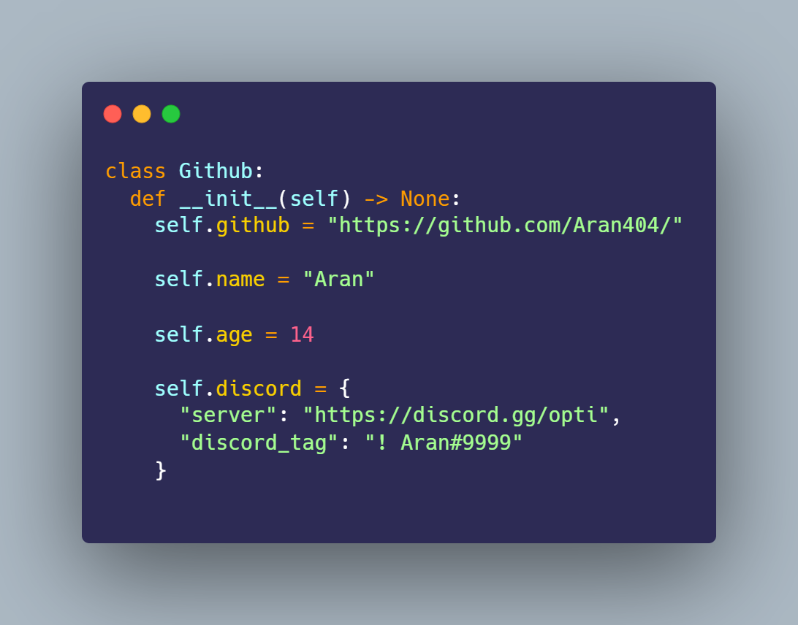
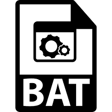

### I am a skid
<a href="https://aran.wtf"><strong>Personal Website</strong></a>  

<a href="https://github.com/Aran404/Aran404">
    

## **Socials**
<a href="https://optiservices.sellix.io"><strong>Sellix</strong></a>  
    
<a href="https://discord.gg/opti"><strong>Discord Server</strong></a>
    
<a href="https://lookup.guru/905989612814606356"><strong>Discord Profile</strong></a>
    
<a href="https://open.spotify.com/user/3ivkrpjttiwesyvqqfu946vy9"><strong>Spotify</strong></a>    

    
## **Statistics**
 <-- Most were made using a botter for fun
    

    

    

    
## **Languages**
- Python 
- Golang 
- Batch 
- Javascript/Nodejs 
- Html 
- Css 

    
## **Tools**
- Visual Studio Code 
- Pycharm 
- Juypter 
 
    
## **Checklist for 2022**
- [x] Be a Skid
- [x] Get 50 Stars
- [x] Learn Python
- [x] Learn Golang
- [x] Get 25 Followers
- [ ] Get 50 Repositories

    
## **Skids**
Learn to code 🤓

